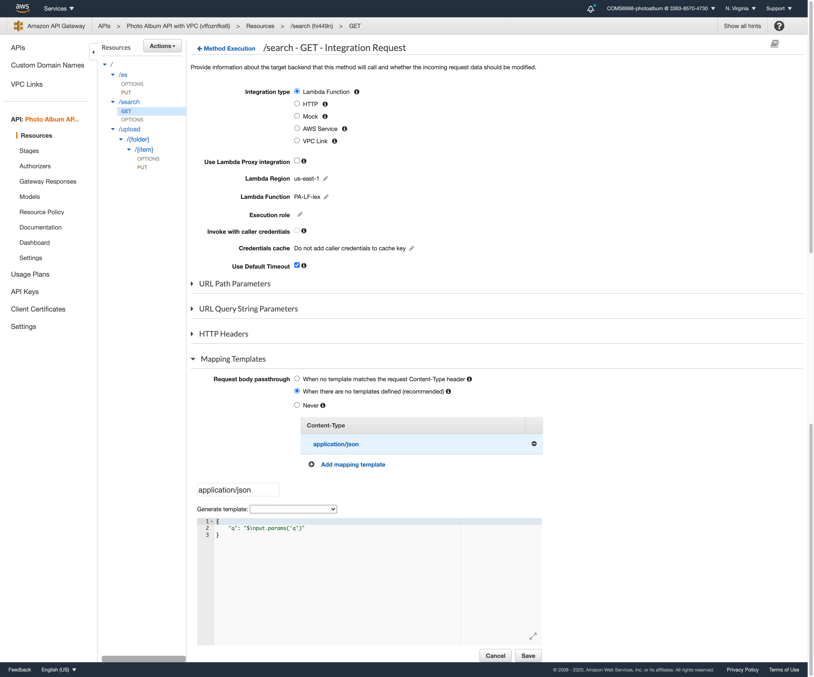

# Photo Album Application

This project implements a photo album web application that can be searched using natural language through both text and voice. Meanwhile, users can upload photos to the album and the back-end service would automatically analyze the objects in the photos and create index (labels) for searching.
The project integrates AWS Lex, Elasticsearch and Rekognition to create an intelligent search layer to query photos given different labels (objects) in them.

Meanwhile, a CloudFormation template is also designed to help set up the entire application infrastructure stack with "one" click. Two CodePipelines are also implemented to support continuous front-end and back-end deployments integrated with GitHub.

## Workflow

A workflow demo video for this project: https://www.youtube.com/watch?v=9kT48OM7Q-0

### Photo Searching
In the application front-end interaction web page, a user can input the search query in the searching bar using plain text and voice. To enable voice searching, the user first should click `Start Recording` button and start speaking the query, then click `Stop Recording` when finished. The front-end JavaScript would automatically convert the vioce recording into plain text and display it in the searching bar. User clicks the search button to trigger the searching process. If the back-end services find the matching photos, those photos would be displayed in the web page. If nothing matched photos are found, a line with `Can not find the photos you want.` would show. If the user's search query can not be parsed by the back-end services, a line with `Can not understand your query.` would show.

Supported search queries are like:
- Cats
- Cats and dogs
- Show me cats
- Show me cats and dogs
- Show me photos with cats
- Show me photos with cats and dogs

### Photo Uploading and Indexing
In the application front-end interaction web page, a user can also upload the photo from local to the album. Should the user click `Choose File` button and select the photo in the pop-up window. Then, click `Upload Photos` button to upload the selected photo. The back-end services would upload the photo into the storage service and analyze the objects in the photos to create index (labels) for searching. After the photo is successfully uploaded, a window would pop up mentions that `Photo uploaded successfully!`.

Supported photo format: .png, .jpeg, .jpg

||
|:--:|
|Application Architecture and Workflow|


## Implementation Details
### VPC Setup
To remain traffic security within the AWS Cloud, this application integrates a VPC to enable secure communication between AWS Elasticsearch and other services. To configure VPC:
1. Create a VPC.
2. Create at least two subnets.
3. Under Endpoints, create one endpoint for S3 service and another one for Rekognition service to enable to access these two services in Lambda functions.
4. Create a Secutiry Group under the VPC created in step 1 with the following inbound rules:
   

### Launch an Elasticsearch Instance
1. Use AWS Elasticsearch service to create a new domain called ``photos``.
2. Make sure to deploy the ES under the VPC created in the above step (prevents unauthorized internet access to the service).
3. Attach the Security Group created in the above step to the ES domain.

### Upload & Index Photos
1. Create a S3 bucket (​``photo-album-demo``) to store the photos.
2. Create a Lambda function (​`LF1`​) to index photos.
   - Launch the Lambda function inside the same VPC as Elasticsearch. This ensures that the function can send request and get returns from the Elasticsearch instance.
   - Make sure the Lambda has the same Security Group as the Elasticsearch.
3. Set up a PUT & POST event notification trigger on the photos S3 bucket, such that whenever a photo gets uploaded to the bucket, it triggers the Lambda function (​`LF1`​) to index it. Detailed configuration is showed below:
    
4. Implement the photo indexing Lambda function (​``LF1``​):
   - For every S3 triggered event, use Rekognition ``detect_labels`` function to analyze the objects (labels) in the photo.
   - Store a JSON object in an Elasticsearch index (``photos``) that references the S3 object from the event and a list of string labels, one for each label detected by Rekognition. Use the following schema for the JSON object:
        ```JSON
        {
            "objectKey": "cat.jpg",
            "bucket": "photo-album-demo",
            "createdTimestamp": "2020-12-03T10:58:01",
            "labels": [
                        "Cat",
                        "Mammal",
                        "Pet",
                        "Animal"
                      ] 
        }
        ```

### Search Photos
1. Create an Amazon Lex bot to parse search queries.
   - Create an intent named ``SearchIntent``.
   - Add training utterances to the intent, such that the bot can pick up at least one or two keywords in the search query like ``cats and dogs``, as well as sentence queries like ``show me cats``, ``show me photos with cats and dogs``.
   - Some implementation details:


2. Implement the Lambda function (``LF-lex``) to parse the search query.
   - Inside ``LF-lex``, the function connects to the Lex bot and passes the search query to the bot.
   - Lex bot analyzes the query and returns the result record.
   - ``LF-lex`` function returns the keyword slot if the Lex bot understands the query; or returns `Can not understand your query.` if the Lex bot doesn't understand.
   - _Note: The `LF-lex` function is deployed outside the VPC since Lex bot can only be accessed via public endpoint._

3. Implement the Lambda function (`LF2`) to search photos based on keywords.
   - Launch the Lambda function inside the same VPC as Elasticsearch. Make sure the Lambda has the same Security Group as the Elasticsearch.
   - Passes the keywords to the function `LF2` and search in the Elasticsearch for results.
   - Returns photo's url in the S3 bucket if photo's label matches the keyword.
   - If no photos matched the keyword, then returns string `Can not find the photos you want.` that will later be showed in the front-end web page.

### Build the API Gateway
The API should have three methods:
1. GET `/search?q={query text}`:
    - Connect to `LF-lex` to pass the search query to the Lex bot in the function and return keywords.
    - Some key points in configuration are showed below:
    
    

2. PUT `/es`
    - Connect to `LF2` to pass the keywords to the Elasticsearch in the function and return matched photos' URLs in S3 bucket.
    - No special configuration needs to notice. Simple PUT request.
3. PUT `/upload/{folder}/{item}`
    - Set up the method as an S3 Proxy. The method allows API Gateway to forward the PUT request directly to the S3 bucket.
    - [This](https://docs.aws.amazon.com/apigateway/latest/developerguide/integrating-api-with-aws-services-s3.html) tutorial gives a detailed configuration guide. Locate to `Expose API methods to access an Amazon S3 object in a bucket` section.
    - Some key points in configuration are showed below:
    
    
4. Make sure in the API Settings, configure Binary Media Type to treat image files as binary types. Add types:
   - image/png
   - image/jpeg
   - image/jpg

### Front-end Web Page Layout
1. Build a simple front-end application that allows users to:
   - Make search requests to the GET `/search` endpoint and pass returned keywords to the PUT `/es` endpoint to retrieve photos' URLs
   - Display the results (photos) from the query
   - Upload new photos using the PUT `/upload` endpoint
2. Integrate the API Gateway-generated SDK into the front-end JavaScripts to connect the APIs.
3. Store the static files in the S3 bucket `photo-album-demo`.

### Implement Voice Accessibility in the Front-end Web Page
1. Give users the choice to use voice to perform the search.
2. Integrate Mozilla Web Speech API [SpeechRecognition](https://developer.mozilla.org/en-US/docs/Web/API/SpeechRecognition) to transcribe speech to text in real time, and use the transcribed text to perform the search.
3. This feature is implemented in the JS file `script.js`.

### Create an AWS CloudFormation template for the stack
1. The template `CloudFormation.yaml` declares functions, APIs, S3 bucket, Elasticsearch instance and event source mappings in the AWS Serverless Application Model (SAM) framework.
2. For Lambda functions, should upload the code into a separate S3 bucket `photo-album-code` and attach the file URL in S3 as `CodeUri` for deployment.
3. Instead of adding API trigger under Lambda function `Events` property, it is more straightforward and comfortable for me to design the APIs in the console, and then choose to `CloneFrom` those finished APIs in the CloudFormation template to create.
4. A thorough demo for CloudFormation configuration and afterwards adjustment could be found here: https://www.youtube.com/watch?v=9kT48OM7Q-0&t=149

### Deploy code using AWS CodePipeline
1. Define a CodePipeline that builds and deploys the code for all the Lambda functions and integrated with GitHub. The configuration YAML files used for setup are `samTemplate.yaml` and `buildspec.yaml`. The `samTemplate.yaml` file is basically the same one as `CloudFormation.yaml` with only the `CodeUri` differences. For CodePipeline, Lambda function source code are linked to the folder in the integrated GitHub repo. A relative folder path is attached for each function which points to the folder stores the related function code. Later on, whenever the user pushes a new commit to the source code, the related Lambda function in AWS will be updated.
2. Define a CodePipeline that deploys the front-end static web page code to the S3 bucket `photo-album-demo` and integrated with GitHub. This CodePipeline will simply copy all the files in the integrated GitHub repo to update,  whenever the user pushes a new commit to the repo.
3. A thorough demo for CodePipeline configuration could be found here: https://www.youtube.com/watch?v=9kT48OM7Q-0&t=315
